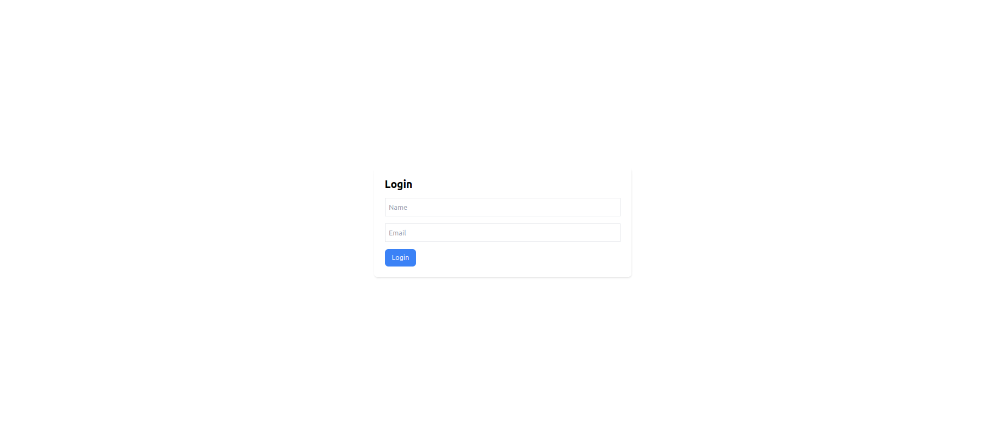
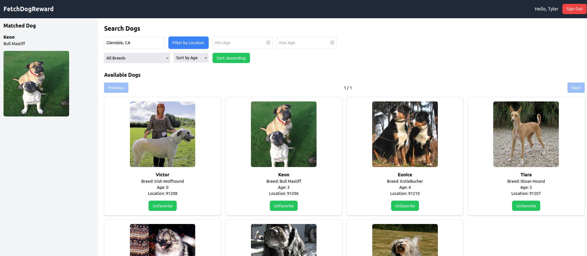

# 🐾 FetchDogReward - Find Your Perfect Dog Match! 🐾

> "It’s not bragging if you can back it up."

FetchDogReward is a React-based web application where dog lovers can search for their perfect furry friend, favorite dogs, and generate a personalized dog match based on their selections. This project demonstrates user authentication, filtering, and paginated data from a shelter dog API. The application is responsive, feature-rich, and scalable for future improvements.

---

## 🏗️ Project Architecture

The project is structured in a **modular and scalable** way, ensuring ease of maintenance and extensibility. The architecture leverages **React functional components**, **TypeScript**, and **TailwindCSS** for the UI/UX, making the project easy to scale while maintaining strong type safety.


### Key Libraries:
- **React**: Core UI library
- **TypeScript**: Static typing for safer and more maintainable code
- **TailwindCSS**: Utility-first CSS framework for responsive and modern design
- **Axios**: HTTP client for making API requests
- **React Router**: For client-side routing between pages

---

## 🌟 Features

### 🔑 Authentication
- User authentication (Login) via `POST /auth/login` API using **name** and **email**.
- User session is stored and maintained using cookies (HttpOnly), automatically sent with every request.

### 🐕 Dog Search
- **Searchable and Filterable** dog listings by breed, location (city/state), and age range.
- **Pagination**: Users can navigate between pages, select a specific page, and view dog listings in chunks.
- **Sort**: Dogs can be sorted by name, breed, or age in ascending or descending order.

### ❤️ Favorite & Match
- Users can **favorite** their preferred dogs from the search results.
- Users can **generate a match** from their favorite dogs by submitting the list to the `/dogs/match` endpoint.
- **Matched dog** is displayed on a **sticky left sidebar**, always visible while browsing.
---

## 🚀 Getting Started

### Prerequisites

Ensure you have the following installed:

- **Node.js** (>=14.x)
- **npm** or **yarn**
- **A Geocode Earth API key** (for validating locations)

### Installation

1. **Clone the repository**:
   ```
      git clone https://github.com/your-username/FetchDogReward.git
      cd FetchDogReward
   ```

2. **Install dependencies**:
   ```
      npm install
      # or
      yarn install
   ```
3. **Set up environment variables: Create a .env file in the root directory and add the following**:
   ```
      REACT_APP_API_BASE_URL=https://frontend-take-home-service.fetch.com
   ```
4. **Start the development server**:
   ```
      npm start
      # or
      yarn start
   ```

## 📖 Usage

### Login
- Open the app and enter your **name** and **email** to log in.
- After logging in, you'll be redirected to the **dog search page**.


### Search & Filter
- Use the **city, state**, **breed**, and **age range** filters to find dogs.
- You can **sort** the results by **name**, **breed**, or **age**.
- **Pagination** is available to browse multiple pages of results.


### Favorite & Match
- Click the "Favorite" button to add a dog to your favorites list.
- The matched dog will appear in the **left sidebar**.

### Logout
- Logout will redirected to **login page**

---


## 💡 Future Improvements

### 📍 GeoLocation Authentication
- Implement **geolocation-based authentication** to provide more accurate search results based on the user's actual location. This feature would allow the app to filter dogs in nearby locations without relying solely on city/state inputs.

### 🖥️ User Input Pagination
- Enhance the **pagination system** by allowing users to directly input the page number and navigate more efficiently between large datasets of dog search results.

### 🛠️ UI/UX Enhancements:
- Improve the **dog card UI** for better mobile responsiveness.
- Add animations and transitions for a more interactive user experience.

### 🧪 Comprehensive Testing:
- Expand test coverage for edge cases and UI components using **Jest** and **React Testing Library**.

---

## ✨ Addiontional Points


FetchDogReward has all the features needed to showcase my skills as a developer, but with a few more tweaks like geolocation validation and enhanced pagination, it can be even better.

---
